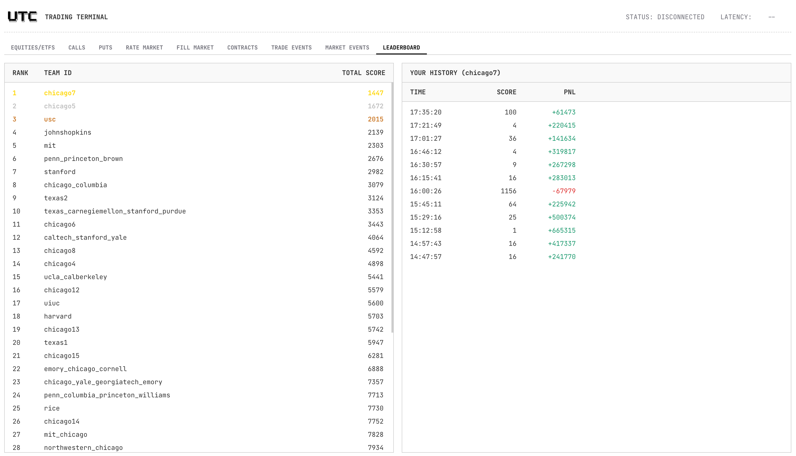

# UChicago Trading Competition 2026
This writeup shares our algorithm design and insights that brought us to 1st place out of 41 teams in Case 1 of the 2026 UChicago Trading Competition, winning the $1,500 top prize. :)
<table>
</table>

<table style="width: 100%; table-layout: fixed; border-collapse: collapse;" border="1">
  <colgroup>
    <col style="width: 25%;">
    <col style="width: 25%;">
    <col style="width: 25%;">
    <col style="width: 25%;">
  </colgroup>
  
  <tbody>
    <tr>
      <td align="center" valign="top" width="250px">
        <a href="https://www.linkedin.com/in/amanthawani">
           
          
<b>Aman Thawani</b> 
</a>Options/Prediction Markets
      </td>
      <td align="center" valign="top" width="250px">
        <a href="https://www.linkedin.com/in/konnor-lo">
           
          
<b>Konnor Lo</b> 
</a>Prediction Markets
      </td>
      <td align="center" valign="top" width="250px">
        <a href="https://www.linkedin.com/in/justinzwang21/">
           
          
<b>Justin Wang</b> 
</a>Stocks/Options
      </td>
      <td align="center" valign="top" width="250px">
        <a href="https://www.linkedin.com/in/brianzjiang">
           
          
<b>Brian Jiang</b> 
</a>Stocks/ETFs
      </td>
    </tr>
  </tbody>
</table>

 

After countless requests, we decided to share the process behind designing our algorithm along with all of our insights to provide inspiration for future competitors. We believe that sharing our ideas advances the competition itself, ensuring that more participants start on similar pages for future iterations.
While this trading competition already introduces many products and trading styles, there is still a lot of untapped potential — especially in designing bot behaviors that create deeper and more exploitable opportunities for highly advanced teams.
We realize that fellow or future participants have varying levels of experience with quant and algorithmic trading, so we tried to make this write-up as detailed and accessible as possible. Some topics are just too deep to explain in a short paragraph, so we included links to external resources that less experienced readers could study.

 

This report goes beyond just presenting our final strategies.
We not only break down those strategies and insights that worked for us, but also share the thought processes and decisions behind them.
That said, this document is mainly intended for fellow or future UChicago Trading Competition participants, since it focuses specifically on 2026's iteration of the trading competition.

 

## Structural Overview

- [Competition Format](#competition-format)
- [The Assets](#the-assets)
- [Algorithm](#algorithm)
  - [Market Making](#market-making)
  - [ETF Arbitrage](#etf-arbitrage)
  - [Directional Signal Finding](#directional-signal-finding)
  - [Earnings Calls](#earnings-calls)
  - [FedSpeak-Based NLP Directional Trading](#fedspeakbased-nlp-directional-trading)
  - [Put-Call Parity](#put-call-parity)
  - [Box Spread](#box-spread)
- [Manual Trading and DJ Deck](#manual-trading-and-dj-deck)
- [Risk Management and Position Architecture](#risk-management-and-position-architecture)
- [Reflections](#reflections)
- [Results](#results)
- [FAQ](#faq)
  - [Why a DJ Deck?](#why-a-dj-deck)
  - [What else did we try?](#what-else-did-we-try)

 

## Competition Format

UChicago's Trading Competition is a university-wide [algorithmic trading](https://www.investopedia.com/terms/a/algorithmictrading.asp) competition with two cases and 41 teams participating this year. Case 1, the algorithmic trading challenge, consisted of 12 rounds and tasked teams with designing trading algorithms to maximize profits across a variety of simulated products — replicating real-world opportunities such as [market making](https://www.investopedia.com/terms/m/marketmaker.asp), [statistical arbitrage](https://www.investopedia.com/terms/s/statisticalarbitrage.asp), [scalping](https://www.investopedia.com/terms/s/scalping.asp), and [regular arbitrage](https://www.investopedia.com/terms/a/arbitrage.asp).

The competition was gamified: each team represented traded fictional assets A, B, and C, along with an [ETF](https://www.investopedia.com/terms/e/etf.asp) analog) of those assets, [options contracts](https://www.investopedia.com/terms/o/option.asp), and a federal reserve [prediction market](https://www.investopedia.com/terms/p/prediction-market.asp).

Throughout each round, teams either kept or submitted an updated version of their trading algorithm, which was then evaluated against both a marketplace of bot participants (typically [liquidity providers](https://www.investopedia.com/terms/l/liquidity.asp)) and other teams. Teams could study and optimize their algorithms by analyzing bot behaviors and interactions (e.g., predictable quoting or trading patterns) as well as statistical patterns in the price series themselves, both within a single product and across multiple related products (such as deviations between an ETF and its underlying constituents). In addition to algorithmic trading, each round featured an option to submit manual click trades by discretion at any time. Although these were typically unfavored by most teams, we chose to use this to our advantage, taking discretionary trades when we felt there was easy statistical arbitrage, and managing risk through closing/balancing out positions. The profit and loss (PnL) from this evaluation determined each team's standing relative to all others on the leaderboard, as the score you gain from each round was (n-1)^2, where n is your ranking out of 41 teams in the round. Finally, the sum of all your round scores is taken, and the lowest scoring team wins.

A key feature of Case 1 is the tight coupling between assets, which implies that pricing must be treated as a joint system rather than a set of independent processes. The ETF enforces a near-linear relationship between A, B, and C through its creation and redemption mechanism, so deviations between ETF price and net asset value define a constrained arbitrage band. In parallel, stock C introduces a macro linkage via the Federal Reserve prediction market, where quoted probabilities map to expected rate changes, then to yields, and finally to both valuation multiples and bond portfolio adjustments. This produces a multi-layer dependency graph in which exogenous signals propagate through several transformations before affecting tradable prices. Efficient strategies therefore require real-time estimation of implied fair values across all assets and continuous reconciliation against observed market quotes.

From a strategy composition perspective, the environment is effectively a hybrid control problem with competing objectives. Market making provides spread capture under inventory constraints and stochastic fills, which can be modeled through queue dynamics and adverse selection risk. Arbitrage strategies such as ETF dislocations and put-call parity violations introduce near risk-free trades, but their frequency is state-dependent and declines as markets become more efficient. Directional signals derived from earnings or macro news introduce alpha but increase variance and tail risk. Optimal performance arises from dynamically allocating capital and risk budget across these components, subject to position limits and execution frictions. This requires integrating signal processing, execution logic, and risk management into a unified framework that adapts to changing liquidity, volatility, and information flow regimes.

For full documentation on the algorithmic trading environment and more competition context, please refer to the [Case Packet](case-packet.pdf).

 

## The Assets

Case 1 presented six tradeable products, each with its own pricing mechanics, information structure, and opportunity set. Understanding how each asset was designed — and how bots and other teams would interact with it — was foundational to building a competitive algorithm.

**Stock A** is a small-cap company whose price is driven entirely by earnings. Twice per day, the exchange broadcasts a structured earnings message containing the company's latest EPS. Combined with a price-to-earnings (P/E) ratio, this gives a direct formula for fair value: `Price = EPS × PE`. A also receives unstructured news headlines that may carry positive or negative sentiment about the company, offering a secondary signal on top of the fundamental model. Because price discovery is tied to discrete, observable events, the opportunity in A is less about reading continuous order flow and more about reacting to information faster and more accurately than other participants.

**Stock B** is a liquid semiconductor company for which no fundamental information is provided — you have no insight into where its stock price is heading. The exchange does, however, quote a full European option chain on B: calls and puts across three strikes (950, 1000, 1050) at every tick. This makes B almost entirely an options problem. The stock itself serves as a hedging vehicle for option positions rather than a standalone directional opportunity. Strategies like [put-call parity](https://www.investopedia.com/terms/p/putcallparity.asp) arbitrage and [box spreads](https://www.investopedia.com/terms/b/boxspread.asp) become the natural candidates here.

**Stock C** is a large-cap insurance company with a more complex two-component pricing model. Its equity portion behaves like Stock A — driven by EPS and a P/E ratio — but the P/E ratio is not constant. It shifts as a function of interest rates: `PE_t = PE_0 × e^(-γ(y_t - y_0))`. On top of the equity component, C holds a large bond portfolio whose value responds to yield changes through duration and convexity: `ΔB ≈ B₀(-D·Δy + ½·Conv·(Δy)²)`. The final price of C blends both components. Since yields are tied directly to Fed rate decisions, C's price is effectively a joint function of company fundamentals and macroeconomic policy — making the prediction market a key secondary input to C's pricing model.

**The ETF** holds exactly one share each of A, B, and C. At any time, a participant can swap one ETF share for one share of each underlying (or vice versa), paying a fee of 5 ticks per share in either direction. This creation and redemption mechanism enforces a hard arbitrage constraint: if the ETF trades more than 5 ticks away from the sum of its components, a near risk-free profit exists. In practice, the ETF was structurally the mispriced leg rather than the individual components — a pattern consistent with real-world ETF dynamics, where ETF prices can lag the underlying.

**Options on B** are European-style contracts expiring at the end of each round, quoted across all three strikes simultaneously. Two structural no-arbitrage relationships hold between them: put-call parity (`C - P = S - Ke^(-rT)`) and box spread pricing (a combination of bull and bear spreads that collapses to a deterministic payoff at expiry). Violations of either relationship, after accounting for transaction costs, represent pure arbitrage.

**The Prediction Market** offers contracts on three Federal Reserve outcomes: a 25 basis point rate hike (`R_HIKE`), no change (`R_HOLD`), and a 25 basis point cut (`R_CUT`). Each contract settles to 1000 ticks for the winning outcome and 0 otherwise. The exchange provides two signal types: structured CPI prints (actual versus forecast inflation data) and unstructured FedSpeak news headlines. Because rate decisions determine yields, and yields determine C's price through the bond portfolio component, the prediction market is not just a standalone product — it is a direct input into C's fair value model.

 

## Algorithm

### Market Making

[Market making](https://www.investopedia.com/terms/m/marketmaker.asp) — posting simultaneous bid and ask quotes and earning the spread — was the first strategy we explored. In theory, if you can estimate fair value accurately and quote symmetrically around it, you collect the spread from uninformed participants while managing inventory risk from informed ones.

In practice, we found this approach less reliable for the assets in this competition. For stocks A and C, fair value is driven by discrete news events rather than continuous price diffusion. Between events, there is limited edge in being a passive liquidity provider, and after events you risk being on the wrong side of a rapid directional move as other participants update their quotes. Our market making experiments on A and C underperformed our directional approach in testing, so we redirected that effort.

We also attempted market making on the prediction market contracts. This exposed a structural problem: because the prediction market experiences large, sudden swings on news events, passive limit orders on the wrong side get filled immediately at adverse prices. There is no gradual adverse selection — the move happens all at once. A market maker in this environment is essentially selling event risk at a thin spread, which is a poor trade.

Recognizing these limitations early, we shifted our focus entirely to taking positions rather than making them.

### ETF Arbitrage

ETF arbitrage was our most consistent source of alpha, generating reliable profits across every round of the competition through frequent small-to-medium PnL captures.

The arbitrage logic checks for mispricings in both directions at every book update:

- **Buy ETF, sell the basket:** If `A_bid + B_bid + C_bid > ETF_ask + swap_fee`, simultaneously sell A, B, and C at their best bids while buying the ETF at its best ask, then swap the ETF into its components to flatten.
- **Buy the basket, sell ETF:** If `ETF_bid > A_ask + B_ask + C_ask + swap_fee`, simultaneously buy A, B, and C at their best asks while selling the ETF at its best bid, then swap the components into the ETF to flatten.

In both cases, the swap operation converts the four-legged position back to zero inventory. Every execution was atomic: all four orders fire simultaneously, the swap closes immediately afterward, and any residual positions are detected and cleaned up before a new arb batch begins.

Across every round we observed, the ETF was always the mispriced leg — not the individual components. This meant we could treat the components as the reference price and the ETF as the mean-reverting instrument, which made the arbitrage highly reliable and directionally consistent.

Trade sizing scaled dynamically with both the observed edge and a rolling estimate of recent arb richness. In thin markets with narrow spreads, we scaled down; in richer environments, we sized up to the maximum order size of 40. Since arb positions clear almost instantaneously, we permanently reserved only 40 units of the 200-share absolute position limit for the arb bot — leaving the remaining capacity available for directional trading.

### Directional Signal Finding

Directional trading on A and C was our primary alpha source, responsible for the largest PnL jumps in each round — often $50,000 to $100,000+ per position entry.

The core idea: compute a fair value from a pricing model, compare it against the live mid-price, and take a position when the gap exceeds a threshold. What makes this work in a competitive setting is speed and model accuracy. If your fair value updates on an earnings release faster than the bots and other teams reprice their quotes, you can take the position before the market closes the gap.

We capped directional positions at 150 shares per symbol (out of the 200-share absolute limit), with the remaining 40 reserved for arb. Since arb positions clear in milliseconds, the combined peak exposure at any instant was at most 190 shares — within the hard limit with a 10-share buffer for unexpected timing edge cases.

Position sizing was proportional to both the signal's confidence and the magnitude of the edge. A larger edge relative to the expected maximum implied more conviction and a larger target. We also tracked the recent price range per symbol to dynamically adjust entry and exit thresholds: in low-volatility, range-bound conditions we required less edge to enter; in trending, high-volatility regimes we required more, avoiding overtrading on noise.

### Earnings Calls

For Stock A, every pricing decision flows from one formula: `fair_A = EPS × PE`. When an earnings message arrives, we update EPS and compute a new fair value. If the market has not yet repriced, a directional opportunity exists in the gap between our computed fair value and the current mid-price.

The case packet provided the theoretical model parameters. Interestingly, we found that *not* using those parameters and instead calibrating our PE ratio from the first live market observation worked significantly better. On the first tick with a valid order book, we set `PE = mid_price / EPS` — fitting the PE to the actual market price observed in that round rather than the case's idealized constant.

There are a few reasons why this calibration approach outperforms the theoretical value. The bots in each round quote based on their own model interpretations, the specific EPS path for that round, and the round's volatility regime. The calibrated PE is specific to the live conditions of *this* round. By anchoring to the first observable market price, our fair value is immediately consistent with what other participants are pricing, rather than potentially systematically above or below. From that calibrated baseline, any shift in EPS represents a genuine signal rather than noise from a miscalibrated prior.

The same calibration logic applies to Stock C's equity component. But C's pricing is more complex because the PE itself shifts with interest rate expectations. When a new EPS for C arrives, we recompute fair value by applying the rate-adjusted PE and adding the bond portfolio's sensitivity to the expected yield change, derived from our probability estimates for each Fed outcome: `E[Δr] = 25 × q_hike − 25 × q_cut`.

### FedSpeak-Based NLP Directional Trading

Because Stock C's price depends on Fed rate expectations, any information about the direction of rates is also information about C's fair value. We processed two types of rate signals: structured CPI prints and unstructured news headlines.

**Structured CPI prints** are the most actionable signal. When actual CPI exceeds the forecast, inflation is running hot — hawkish pressure — and we shift probability mass toward a rate hike. When actual undershoots forecast, we shift toward a cut. The magnitude of the shift scales with how large the surprise is relative to a typical CPI move.

**Unstructured FedSpeak headlines** are processed with keyword matching across dictionaries of hawkish terms (inflation, hike, restrictive, overheat) and dovish terms (cut, recession, easing, slowdown). A headline's net sentiment score nudges `q_hike` and `q_cut` proportionally.

Both signals feed into `q_hike`, `q_hold`, and `q_cut` — our running probability estimates for each Fed outcome — which are continuously blended with live prediction market quotes. The market prices provide a real-time, market-implied anchor that stops our model from drifting too far from what other participants are actually pricing.

Each signal type carries a different confidence weight that governs how aggressively we act on the resulting fair value update:

| Signal | Confidence |
|---|---|
| C earnings (EPS) | 0.90 |
| CPI print | 0.60 |
| Prediction market prices | 0.40 |
| FedSpeak headlines | 0.20 |

Our minimum confidence threshold to initiate a new directional trade is 0.25. This means FedSpeak headlines alone — at confidence 0.20 — update C's fair value model without directly triggering a position. They shift the background probabilities, which then compound with the next higher-confidence event (a CPI print or earnings release) to produce a more informed trade. This tiered design prevents overreacting to ambiguous headlines while still capturing their marginal information content.

Separately, Stock A also receives unstructured headlines. We parsed these with a dedicated sentiment dictionary for A-specific keywords (wins, deal, upgrade, lawsuit, recall, downgrade) and adjusted A's fair value proportionally to the sentiment score when a headline was clearly about Stock A.

### Put-Call Parity

[Put-call parity](https://www.investopedia.com/terms/p/putcallparity.asp) states that for European options sharing the same strike and expiry: `C − P = S − Ke^(−rT)`. When quoted calls and puts violate this relationship — after accounting for transaction costs — the mispriced leg can be traded against the fairly-priced one for a risk-free profit.

We built and tested a dedicated put-call parity bot on Stock B's option chain. In practice, any mispricings that appeared were smaller than the bid-ask spread on the options, making them impossible to capture without crossing the spread and giving back the entire edge. The options market was structured such that spreads absorbed any theoretical arbitrage — a pattern common in real-world options markets on less liquid underlyings.

There was also a risk management reason to avoid options entirely. In later rounds, some teams began buying out entire sides of order books and posting extreme prices on the other side, effectively trapping any resting limit orders into catastrophic fills. Any strategy that required passively posting option quotes would have been directly exposed to this behavior. Since we had no profitable edge in options to justify that tail risk, we cut them entirely from our final bot.

### Box Spread

A [box spread](https://www.investopedia.com/terms/b/boxspread.asp) combines a bull call spread and a bear put spread at two different strikes, creating a position whose payoff at expiry is fixed regardless of where the underlying lands: `payoff = K_high − K_low`. If the cost of constructing the box is below this deterministic payoff (appropriately discounted), an arbitrage exists.

We built a latency-optimized box spread bot that evaluated all three strike pairs (950/1000, 950/1050, 1000/1050) on every book update, with per-symbol dirty tracking to avoid recomputing pairs whose books hadn't changed. Like the PCP strategy, the fundamental obstacle was execution: bid-ask spreads on B's options were consistently wide enough to eliminate any theoretical edge. Testing showed returns fluctuating around zero rather than generating consistent profit.

The same sniping concern applied here — and even more acutely, since a box spread requires touching four option legs simultaneously. We abandoned both options strategies before the competition.

### Manual Trading and DJ Deck

Despite the algorithm handling the bulk of our trading, we also engaged in discretionary manual trading in the early rounds. Rather than using the exchange UI, we mapped our prediction market positions to a physical DJ deck — the kind DJs actually use. Six performance pads each represented a macro hypothesis: one contract long, the other two short or one short, the other two long, in every combination across R_HIKE, R_HOLD, and R_CUT in addition to one that flattened our positions. When we spotted momentum in one direction following a news event, a single button press initiated the position. We could have done this with a keyboard, but the deck was faster, more intuitive under pressure, and admittedly more fun. It also won us the best trading setup award of the competition.

In rounds 1 through 5, this strategy contributed additional profit on top of the algorithm's output. However, the prediction market's volatility made the strategy fundamentally risky: moves were sharp and news-driven, meaning that being wrong about the direction or the exit timing could result in large, rapid losses.

Round 6 was the turning point. A sequence of adverse prediction market moves resulted in a loss of approximately $200,000 in manual trades, flipping that round from a top-5 finish to a 35th place result and a final round PnL of −$68,000. We immediately recognized that the tail risk of manual prediction market trading was not justified by its average contribution. For rounds 7 through 12, we ran the algorithm exclusively.

### Risk Management and Position Architecture

One of the most important decisions in our design was how we isolated the arb and directional strategies from each other within a shared position limit.

Each asset had a maximum absolute position of 200 shares and a maximum single order size of 40 shares. Running two strategies on the same assets without coordination meant they could inadvertently push combined exposure above the exchange limit — causing silent order rejections that we would only discover after missed fills.

Our solution was a clean allocation: 150 shares permanently reserved for directional positions in A and C, and 40 shares for the arb bot. Since arb positions clear almost instantaneously, the actual combined exposure at any moment peaked well below 200, with a deliberate 10-share buffer for timing edge cases. The arb bot computed its residual position as `exchange_position − directional_position`, keeping the two strategies' accounting fully isolated.

This architecture came directly from painful testing experience. In earlier versions with less disciplined position tracking, we frequently breached limits mid-round — causing the exchange to reject orders and forcing us to manually stop the bot, clear positions, and restart, losing alpha in the process. By the time we ran in the competition, position limit rejections were a non-issue.

 

## Results

Across 12 rounds, the algorithm placed consistently in the top 5. Rounds 1 through 5 averaged approximately $400,000 in PnL per round, peaking at $665,000 in round 3. Round 6, which included the manual trading loss, ended at −$68,000 — our only negative round. Rounds 7 through 12 were steadier, ranging from the high $200,000s to $320,000, reflecting the case's intended design of decreasing edge as later rounds introduced faster-responding bots and tighter spreads.

The competition's scoring formula weighted later rounds more heavily and moderated the impact of single-round outliers in both directions. This design benefited a team running a consistent, risk-controlled algorithm over one relying on high-variance strategies. 

 

## Reflections

In earlier rounds, we were generating significant profit from both ETF arbitrage and directional trades, as well as click trading on the prediction markets. However, in later rounds, ETF mispricings became much less common, and directional trades became our main driver of profit. Since the market dynamics shift over time, it is important to have multiple profit-generating strategies in place.

One of our biggest mistakes was our attempt to manually trade on the prediction markets. It was immediately clear in Round 1 that the exchange would freeze sporadically, so, while the algorithm could run without issues, we were unable to flatten if the exchange froze while we had outstanding positions. This hurt us significantly in Round 6, when a freeze combined with news events led to the prediction markets prices shifting drastically while we had maximum positions, resulting in an almost-instant drop of 200k PnL. Given that the news events were relatively unpredictable in the first place, it was also possible for something similar to have occurred even without the exchange freezing, so the idea to trade manually carried much more risk than it was worth. In hindsight, given that the leaderboard methodology prioritized consistently high placement, it would have been better to not have click traded at all. 

In the final rounds of the competition, some teams adopted an adversarial strategy: buying out one side of a product's order book and posting extreme prices on the other side, effectively trapping any resting market orders into catastrophic fills. Our primary defense was structural: we did not post resting limit orders in products we were uncertain about. By the time sniping became common in later rounds, we had already stopped prediction market trading and we did not trade the options (which had the least liquidity and hence seemed the most prone to sniping). Our remaining exposure was in A, C, and the ETF — where positions were directional and short-lived, not passive limit orders sitting in a vulnerable book. For the final round, we made a deliberate choice to stop the bot entirely after approximately 8 minutes. By that point, we had calculated that finishing in the top 11 out of 41 teams in that round was sufficient to secure overall first place, given our lead over the second-place team. With teams actively manipulating order books in the final minutes, continuing to trade carried significant downside with limited additional upside.

## FAQ

### Why a DJ Deck?

Partly because we could, and partly because it was genuinely faster. The exchange UI involves sequential clicks, form inputs, and animation delays — none of which are ideal when you're trying to react to a Fed headline in under a second. The DJ deck let us precompile our most common trading actions into single button presses, eliminating that friction entirely.

### What Else Did We Try?

A lot that didn't make it into the final bot:

**Market making on A and C** was our starting point. We built quote-posting logic that maintained bid and ask orders around our estimated fair value. It generated inconsistent results in testing — the discrete, news-driven nature of A and C's pricing meant that quiet periods offered little spread income, while news events created directional risk that passive quotes were poorly positioned for. We abandoned it in favor of taking positions rather than making them.

**Prediction market market making** had the same problem in a more extreme form. Limit orders on the wrong side of a news-driven swing got filled immediately and at a loss. There was no gradual adverse selection — just a sudden move. We tried it, lost money on it, and stopped.

**Put-call parity arbitrage on B's options** was theoretically clean but practically impossible to execute. The bid-ask spreads on the options were always wider than any mispricing we identified, meaning crossing the spread to capture the arb gave back more than the edge. We spent meaningful time building and testing this bot before concluding it had no edge in this competition's market structure.

**Box spread arbitrage** on B's options had the same problem. We built a latency-optimized version that evaluated all three strike pairs on every book update, but the spreads were simply too wide for any theoretical arbitrage to survive execution costs. Returns in testing fluctuated around zero.

In hindsight, the options market in this competition was structured such that spreads absorbed all theoretical arbitrage — which is actually consistent with how illiquid options markets behave in the real world.
